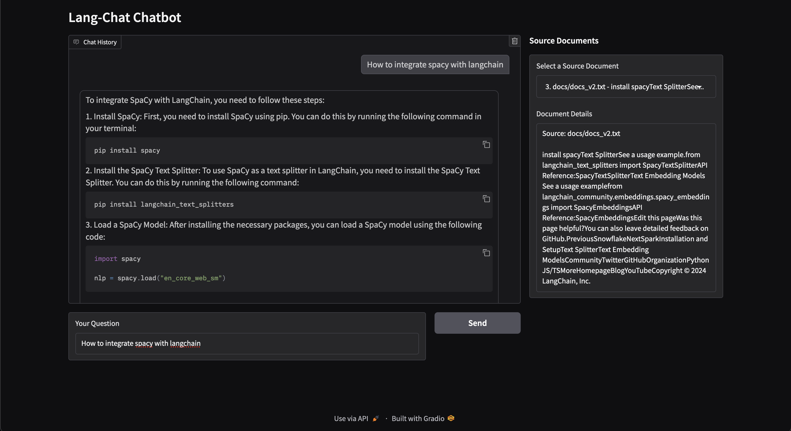

**Lang-Chat** is a chatbot application designed to help users understand the [LangChain](https://langchain.com/) library and troubleshoot issues by leveraging scraped documentation and GitHub issues up to **November 22, 2024**. This project started as a personal tool to deepen our understanding of LangChain and to assist with common issues. During development, we discovered [Chat LangChain](https://chat.langchain.com/) (see [GitHub repository](https://github.com/langchain-ai/chat-langchain)), a more comprehensive implementation available freely.

Despite this, we decided to continue and complete our own version to contribute to the community and offer an alternative solution. **Lang-Chat** serves as a proof of concept and is actively being developed, with more features to be added over time.

 <!-- Optional: Add a screenshot of your app -->

## Inspiration and Concept

The idea behind Lang-Chat was to create a personalized assistant that could help us understand the LangChain library and address issues we encountered. By scraping the documentation and GitHub issues up to **November 22, 2024**, we aimed to build a comprehensive knowledge base. Discovering an existing solution like [Chat LangChain](https://chat.langchain.com/) motivated us to continue our project and potentially offer unique features or perspectives.

### Installation

1. **Clone the Repository**

   ```bash
   git clone https://github.com/Tanmaydoesai/lang-chat.git
   cd lang-chat
   ```

2. **Create a Virtual Environment**

   It's recommended to use a virtual environment to manage dependencies.

   ```bash
   python3 -m venv venv
   source venv/bin/activate  # On Windows: venv\Scripts\activate
   ```

3. **Install Dependencies**

   ```bash
   pip install -r requirements.txt
   ```

4. **Set Up Environment Variables**

   Create a `.env` file in the root directory by copying the `.env.template` file and filling in your API key.

   ```bash
   cp .env.template .env
   ```

   Edit the `.env` file and add your Groq API key:

   ```dotenv
   GROQ_API_KEY="your_groq_api_key_here"
   ```

   You can obtain a free API key from [https://groq.com/](https://groq.com/).

### The following steps are optional if you wish to scrape the documentation and issues again, otherwise the vector databases are provided

1. **Prepare the Data**

   - **Documentation Files:** Place your LangChain documentation files in the `docs/` directory. Ensure they are in `.txt` format.
   - **GitHub Issues:** Scrape and format GitHub issues from the LangChain repository up to **November 22, 2024**, into the `formatted_issues/` directory. Ensure they are in `.txt` format.

2. **Build Vector Stores**

   Before running the application, build the vector stores from your documents and issues.

   ```bash
   python build_vectorstore.py
   ```

   This will process the documents and create vector stores in the `vector_stores/` directory.

### Running the Application

After the previous steps are completed start the Gradio interface by running:

```bash
python app.py
```

After running the command, you should see a local URL (e.g., `http://127.0.0.1:7860/`) in your terminal. Open this URL in your web browser to interact with the Lang-Chat chatbot.

### Usage

1. **Ask a Question:** Enter your question about LangChain in the "Your Question" textbox and press "Send" or hit Enter.
2. **View Chat History:** The chat history will display your questions and the assistant's responses.
3. **Explore Sources:** In the "Source Documents" section, select a source document from the dropdown to view the full content that the assistant referenced.

### Contributing

Lang-Chat is an actively developing proof of concept. Contributions are welcome! Please open issues or submit pull requests for improvements, bug fixes, or new features


Feel free to reach out or open an issue if you have any questions or suggestions!


---